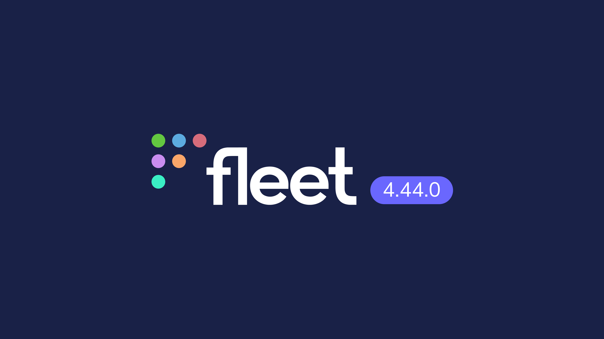

# Fleet 4.44.0 | Query performance reporting, host targeting improvements.

Fleet 4.44.0 is live. Check out the full [changelog](https://github.com/fleetdm/fleet/releases/tag/fleet-v4.44.0) or continue reading to get the highlights.
For upgrade instructions, see our [upgrade guide](https://fleetdm.com/docs/deploying/upgrading-fleet) in the Fleet docs.

## Highlights

* macOS and Windows vulnerabilities
* Run scripts on online/offline hosts
* Label-based profile enablement
* Per-team host expiry
* Enroll secret moves to Keychain and Credentials Manager

### macOS and Windows vulnerabilities

Fleet continues to focus on enhancing security through vulnerability detection. Fleet now has the capability to identify vulnerabilities (CVEs) in the software inventory it collects, specifically for macOS versions 13 and 14, Windows 10 and 11, and Windows Server versions 2012, 2016, 2019, and 2022.

When Fleet detects an OS version with known vulnerabilities, it can trigger automation, such as creating tickets in Jira and Zendesk or calling a webhook. This feature is especially useful for vulnerability management engineers who must monitor and understand the security posture of macOS and Windows versions installed across their hosts. Fleet enables more informed and proactive vulnerability management strategies by providing visibility into which specific versions of these operating systems are vulnerable. This update aligns with Fleet's commitment to enhancing security and efficiency in IT environments, offering essential tools for addressing potential threats in a timely and organized manner.

### Run scripts on online/offline hosts

Fleet now allows IT administrators to execute scripts on hosts, irrespective of their online or offline status. This enhancement allows for a more flexible script execution process, catering to various operational scenarios. Administrators can now schedule and run scripts on any host, regardless of connectivity status, and track the script's execution.

Additionally, this feature provides a comprehensive view of past and upcoming activities related to script execution for a host. IT admins can see a chronological list of actions, including both executed and scheduled scripts, offering clear visibility into the timing and sequence of these activities. This capability is particularly beneficial for ensuring that essential scripts are run in an orderly and timely manner, enhancing the overall management and maintenance of the fleet.

### Label-based profile enablement

IT administrators can now activate profiles for hosts based on specific labels, enabling more dynamic and attribute-based profile management. This functionality is particularly useful for tailoring configurations and policies to hosts that meet certain criteria, such as operating system versions. For example, an IT admin can now set a profile only to be applied to macOS hosts at or above macOS version 13.3. This approach facilitates a more granular and efficient management of host settings, ensuring that profiles are applied in a manner that aligns with each host's characteristics and requirements while also maintaining a consistent baseline across the fleet.

### Per-team host expiry

Host expiry settings can now be customized for each team. This feature addresses the diverse requirements of different groups of devices within an organization, such as servers and workstations. With this new functionality, endpoint engineers can set varied expiry durations based on the specific needs of each team. For instance, a shorter expiry period, like 1 day, can be configured for teams of servers, whereas a longer duration, such as 30 days, can be applied to your workstation teams. This flexibility ensures that each team's expiry settings are tailored to their operational tempo and requirements, providing a more efficient and effective management of device lifecycles within Fleet.

### Enroll secret moves to Keychain and Credentials Manager

Fleet's latest update addresses a crucial security concern by altering how the `fleetd` enroll secret is stored on macOS and Windows hosts. In response to the need for heightened security measures, `fleetd` will now store the enroll secret in Keychain Access on macOS hosts and in Credentials Manager on Windows hosts rather than on the filesystem. This change significantly enhances security by safeguarding the enroll secret from unauthorized access, thus preventing bad actors from enrolling unauthorized hosts into Fleet.

This update includes a migration process for existing macOS and Windows installations where the enroll secret will be moved from the filesystem to the respective secure storage systems - Keychain Access for macOS and Credentials Manager for Windows. However, Linux hosts will continue to store the enroll secret on the filesystem. This improvement demonstrates Fleet's commitment to providing robust security features, ensuring that sensitive information like enroll secrets is securely managed and less susceptible to unauthorized access.

## Changes

* **Endpoint operations**:
  

### Bug fixes and improvements

## Ready to upgrade?

Visit our [Upgrade guide](https://fleetdm.com/docs/deploying/upgrading-fleet) in the Fleet docs for instructions on updating to Fleet 4.44.0.

<meta name="category" value="releases">
<meta name="authorFullName" value="JD Strong">
<meta name="authorGitHubUsername" value="spokanemac">
<meta name="publishedOn" value="2024-01-09">
<meta name="articleTitle" value="Fleet 4.44.0 | Query performance reporting, host targeting improvements.">
<meta name="articleImageUrl" value="../website/assets/images/articles/fleet-4.44.0-1600x900@2x.png">
